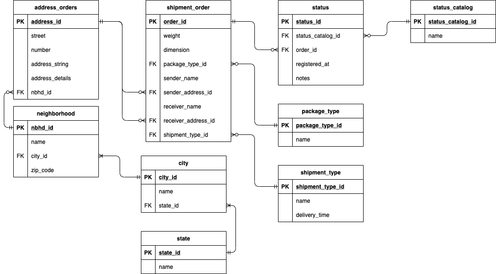

# shipping_db
### Database (PostgreSQL) 

- In a PostgreSQL server/instance run [DDL file](https://github.com/JordyVargas93/shipping_db/blob/main/database-model/shipping_db_ddl.sql). 
- Once, the schema and the tables are created, you can run the [test data](https://github.com/JordyVargas93/shipping_db/blob/main/database-model/test_data.sql) file.
- The entity-relation model of the database is described below:

### ETLs (Python)

- You can find the code of the ETLs [here](https://github.com/JordyVargas93/shipping_db/tree/main/etl)
- **Requirements**
  - Python 3
  - Install the [requirements](https://github.com/JordyVargas93/shipping_db/blob/main/etl/requirements.txt) with *pip*
  > pip install -r requirements.txt
- Run it!
